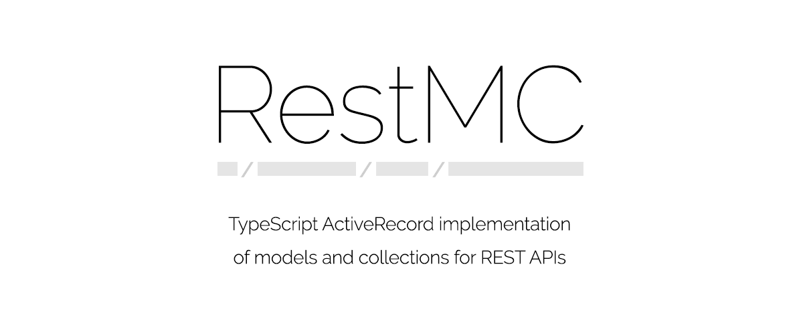

[](https://paypal.me/polymermallard)

TypeScript Models and Collections for working with REST APIs. Backbone-style ergonomics, modern types, fluent builders, lifecycle events, and a relationship system that handles `hasOne`/`hasMany` with parent-aware endpoints.

## Install

    $ npm install restmc
    # or
    $ yarn add restmc

## Quick start

```ts
import { Model, Collection } from 'restmc';

class User extends Model {
    public endpoint = 'users';
    public baseUrl = 'https://api.example.com/v1';
}

class UserCollection extends Collection<User> {
    public model = new User();
    public endpoint = 'users';
    public baseUrl = 'https://api.example.com/v1';
}

const users = new UserCollection();

await users.fetch();
console.log(users.length);              // number of fetched users
console.log(users.first().attr('name'));
```

## Working with Models

```ts
const user = new User({ id: 42 });

await user.fetchById(42);                // GET /users/42
user.set({ name: 'Matt' });
await user.save();                       // PUT /users/42

await user.delete();                     // DELETE /users/42 — auto-removes
                                         // from any parent Collection
```

## Working with Collections

```ts
const users = new UserCollection();
await users.fetch();

users.first();                           // first model
users.last();                            // last model
users.at(2);                             // model at index 2 (negatives ok)
users.get(42);                           // by id
users.has(42);                           // boolean

// Filter (returns plain array)
users.filter((u) => u.attr('active'));

// Filter (returns chainable Collection)
users.filterAsCollection((u) => u.attr('active')).sort({ key: 'name' });

// Attribute matching
users.where({ status: 'active' });                       // new Collection
users.where({ status: 'active' }, { first: true });      // first match or null
users.where({ status: 'active' }, { inPlace: true });    // mutate this collection

// Pagination (driven by response meta.pagination)
if (users.hasNext()) {
    await users.fetchNext();             // append next page
}
```

## Relationships

```ts
class User extends Model {
    public reviews(): ReviewCollection {
        return this.hasMany('reviews', ReviewCollection);
    }

    public profile(): Profile {
        return this.hasOne('profile', Profile);
    }
}

const user = await new User().fetchById(42);

// Lazily built; cached on the model. Endpoint composes through the parent
// chain when Model.useDescendingRelationships is true.
const reviews = user.reviews();
await reviews.fetch();                   // GET /users/42/reviews
```

## Lifecycle events

Every Model/Collection extends a Dispatcher. Hook into the request lifecycle:

```ts
import { Events } from 'restmc';

users.on(Events.Request.Complete, ({ detail }) => {
    console.log('done', detail.response.status);
});

users.on(Events.Collection.Add, ({ detail }) => {
    console.log('added model(s)', detail);
});

users.on(Events.Cache.Hit, ({ detail }) => {
    console.log('cache hit for', detail.cacheKey);
});
```

Common events: `requesting`, `complete`, `complete:get`, `complete:post`, `cancel`, `error`, `error:get`, `add`, `remove`, `change`, `cache:hit`, `cache:set`, `request:deduped`.

## Canceling requests

```ts
const request = users.fetch();

users.cancelRequest('User navigated away');

await request.catch(({ cancelReason }) => {
    console.log(cancelReason);              // User navigated away
});
```

## Caching

```ts
await users.cache(60_000).fetch();       // cache this fetch for 60s
```

Cache keys include URL, method, body, and a hash of the `Authorization` header so different bearer tokens don't share entries.

## Mocking responses

For tests / dev:

```ts
const json = { data: [{ id: 1, name: 'Matt' }], meta: { pagination: [] } };

await users.mock(json).fetch();          // returns the mock, then auto-clears
```

## Configuration

```ts
import { Model } from 'restmc';

class Review extends Model {
    public baseUrl = 'https://api.example.com/v1';
    public endpoint = 'reviews';
    public dataKey = 'data';              // unwrap response.data.data
    public headers = { 'X-Custom': '1' };
}

// Static, global config
Model.relationshipKey = 'relationships';  // where nested rels live in the JSON
Model.useDescendingRelationships = true;  // /users/42/reviews vs /reviews
```

Per-request token:

```ts
users.setToken(currentBearerToken);       // sets Authorization: Bearer <token>
await users.fetch();
```

## Build

```
$ npm run build      # ESM + CJS to ./build
$ npm run test       # mocha unit tests
$ npm run lint       # eslint over src/
```

## License

**restmc** © [polymer mallard](https://polymermallard.com), released under the [GNU](https://github.com/mattkenefick/restmc/blob/master/LICENSE.md) License.

Authored and maintained by Polymer Mallard with help from [contributors](https://github.com/mattkenefick/restmc/contributors).

> [polymer mallard](https://www.polymermallard.com) · GitHub [@mattkenefick](https://github.com/mattkenefick)
