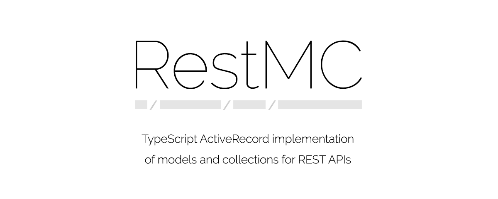

</a>

## Install

    $ yarn add mattkenefick/restmc

## Test

    $ npm run example

## Configure

    @todo

## License

**restmc** © [polymer mallard](https://polymermallard.com), released under the [GNU](https://github.com/mattkenefick/restmc/blob/master/LICENSE.md) License. 

Authored and maintained by Polymer Mallard with help from [contributors](https://github.com/mattkenefick/restmc/contributors).

> [polymer mallard](https://www.polymermallard.com) · GitHub [@mattkenefick](https://github.com/mattkenefick) · Twitter [@mattkenefick](https://twitter.com/mattkenefick)
